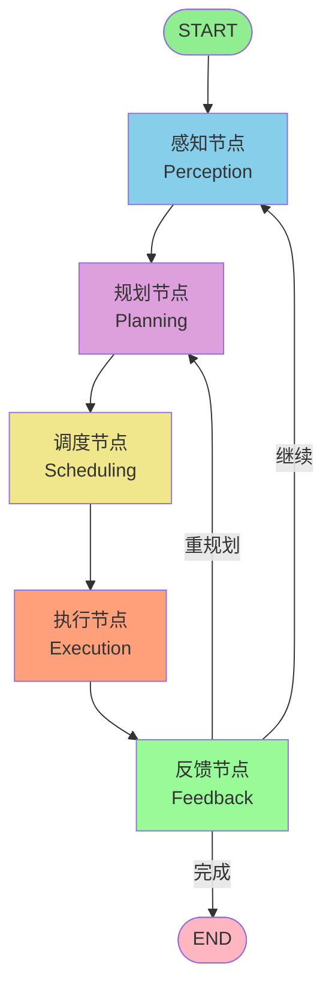

# Humanoid Robot Brain - LangGraph Version

基于 LangGraph Agent 框架的人型机器人智慧大脑系统

## 项目概述

本项目使用 LangGraph 框架重构了人型机器人智慧大脑，实现了完整的认知闭环：

```
START → 感知 → 规划 → 调度 → 执行 → 反馈 → END
          ↑                                  |
          |______________(循环)______________|
```

## 核心特性

### 1. LangGraph 框架集成
- **StateGraph**: 状态图管理
- **条件边**: 动态路由决策
- **检查点**: 状态持久化
- **流式处理**: 实时状态更新

### 2. 节点化架构
- **PerceptionNode**: 多模态感知处理
- **PlanningNode**: 任务规划与分解
- **SchedulingNode**: 任务调度与排序
- **ExecutionNode**: 技能执行与监控
- **FeedbackNode**: 反馈处理与决策

### 3. Agent 系统
- **PerceptionAgent**: 感知专家
- **PlanningAgent**: 规划专家
- **ExecutionAgent**: 执行专家
- **SupervisorAgent**: 中央监督

### 4. 工具系统
- **VLNTool**: 视觉语言导航
- **VLATool**: 视觉语言操作
- **NavigationTool**: 基础导航
- **ManipulationTool**: 基础操作

## 项目结构

```
humanoid_robot_brain_langgraph/
├── state/                  # 状态定义
│   └── state.py           # RobotState 等状态类型
├── nodes/                  # 节点实现
│   ├── perception_node.py # 感知节点
│   ├── planning_node.py   # 规划节点
│   ├── scheduling_node.py # 调度节点
│   ├── execution_node.py  # 执行节点
│   ├── feedback_node.py   # 反馈节点
│   └── decision_node.py   # 决策节点
├── graph/                  # 图定义
│   └── robot_brain_graph.py # LangGraph 图
├── tools/                  # 工具实现
│   ├── vln_tool.py        # VLN 工具
│   ├── vla_tool.py        # VLA 工具
│   ├── navigation_tool.py # 导航工具
│   ├── manipulation_tool.py # 操作工具
│   └── dialogue_tool.py   # 对话工具
├── agents/                 # Agent 实现
│   ├── perception_agent.py # 感知 Agent
│   ├── planning_agent.py   # 规划 Agent
│   ├── execution_agent.py  # 执行 Agent
│   └── supervisor_agent.py # 监督 Agent
├── config/                 # 配置文件
│   └── default_config.json
├── main.py                 # 主入口
└── requirements.txt        # 依赖
```

## 安装

```bash
pip install -r requirements.txt
```

## 快速开始

### 运行演示
```bash
python main.py --demo
```

### 交互模式
```bash
python main.py --interactive
```

### 单条指令
```bash
python main.py --input "导航到厨房"
```

### 查看图结构
```bash
python main.py --graph
```

## 使用示例

```python
from main import HumanoidRobotBrainLangGraph

# 创建大脑实例
brain = HumanoidRobotBrainLangGraph()

# 执行指令
result = brain.run("导航到厨房")
print(result)

# 流式执行
for event in brain.stream("帮我拿杯子"):
    print(event)
```

## 与 LLM 集成

```python
from langchain_openai import ChatOpenAI
from main import HumanoidRobotBrainLangGraph

# 创建 LLM
llm = ChatOpenAI(model="gpt-4")

# 创建大脑实例
brain = HumanoidRobotBrainLangGraph(llm=llm)

# 执行
result = brain.run("帮我找到杯子并把它放到桌子上")
```

## 图结构



## 对比原版本的优势

| 特性 | 原版本 | LangGraph 版本 |
|-----|-------|---------------|
| 状态管理 | 手动字典 | StateGraph 类型化 |
| 流程控制 | 函数调用 | 图边定义 |
| 路由 | 条件语句 | 条件边 |
| 持久化 | 手动实现 | 检查点支持 |
| LLM 集成 | 自定义 | 原生支持 |
| 流式处理 | 无 | 内置支持 |
| 调试 | 日志 | 图可视化 |

## 许可证

MIT License
